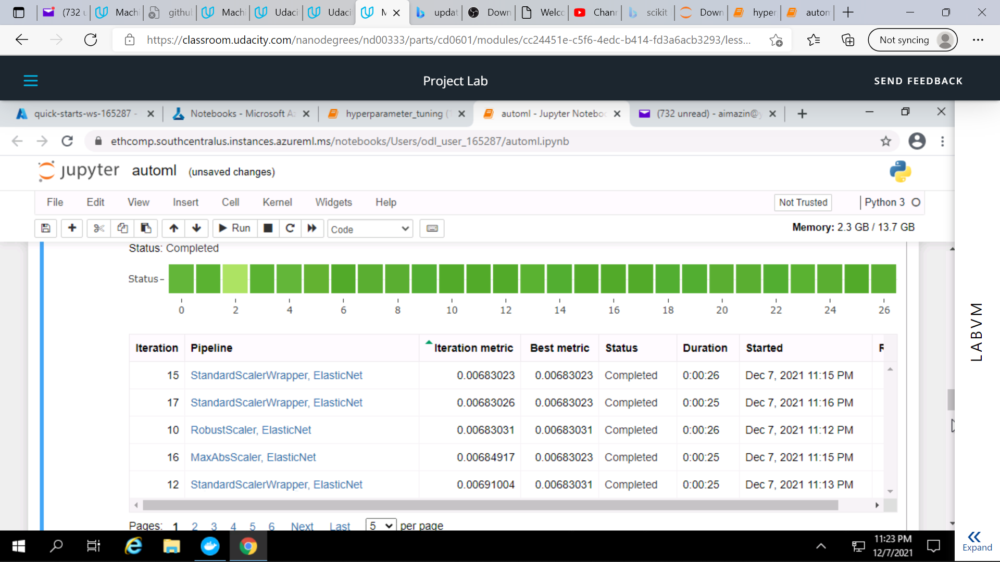
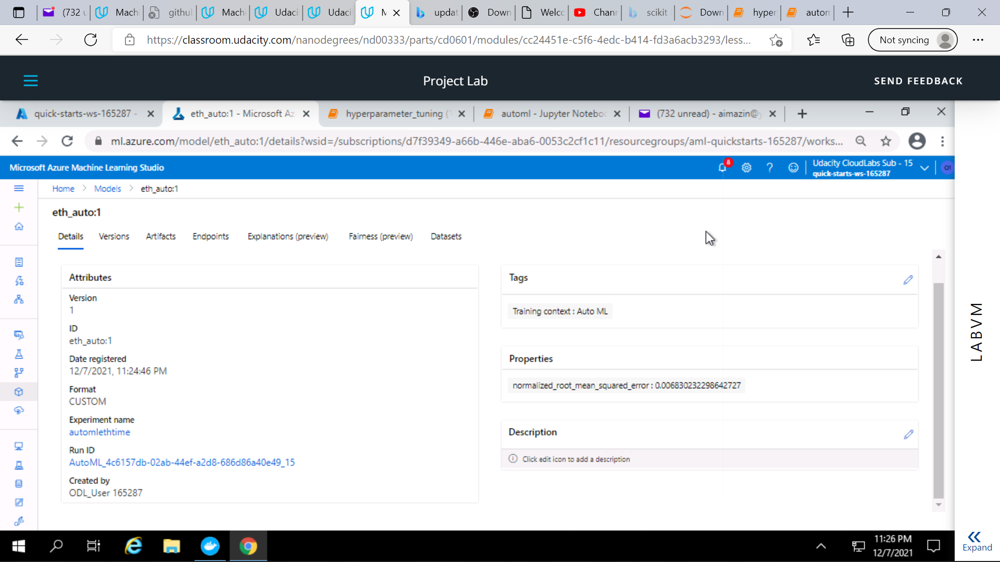
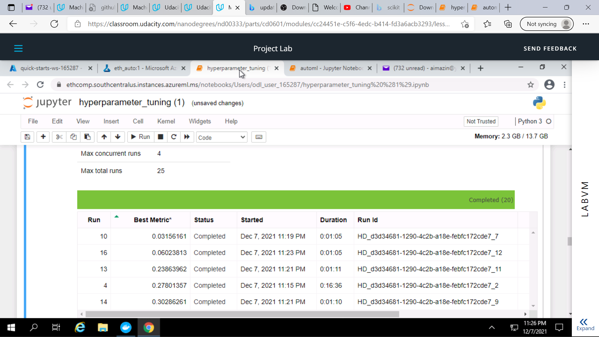
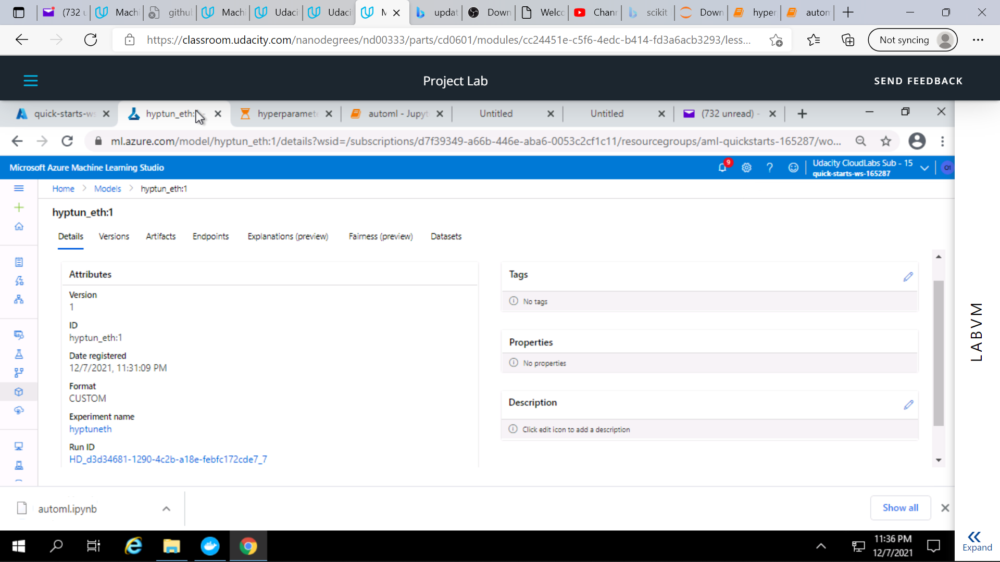

# AutoML Time Series vs Neural Network

This Project establishes the difference between the AutoMl Time Series and Scikit Learn's hypertuned Neural Net on time series data.

## Project Set Up and Installation
*OPTIONAL:* If your project has any special installation steps, this is where you should put it. To turn this project into a professional portfolio project, you are encouraged to explain how to set up this project in AzureML.

## Dataset

### Overview

'ethdata.csv' - It is Ethereum hourly financial data over about 55 days acquired by using the yahoofinance api.

### Task

The task is to predict the closing price "Close" and in AutoML the dates in "Column1".

### Access

The data will be accessed by uploading and registering the dataset in the Azure ML Workspace.

## Automated ML

Since we were time series forecasting I added the date column as a forecasting parameter and configured task to forecasting and prime metric to normalized-RMSE.

### Results

It had an RMSE of about 10 carrying a best model of StandardScalerWrapper, ELasticNet. Could have adjusted parameters for experiment to run longer for more models.

## Hyperparameter Tuning

Well I used scikit-learns MLPRegressor because I thought a neuro network vs an automl would be exciting. The hyperparameters were max_iter between 100 and 1000, and epsilon between 0.0000001 and 1.0 these using a Bandit policy, Trying to minimize RMSE.

### Results

I got RMSE of less than 0.0 with hyperparameters of about 0.5 epsilon and 400 max_iter. Could have improved it by running more models only 25 were run and more hyperparameters.

## Model Deployment

The deployed model is from the best registered model from the hyperdrive experiment and was deployed using the score.py file. The endpoint was consumed first of all having the raw data be present to the site as json. The requests post is used to render a response from the json uri string and header for json applications.

## Screen Recording
- A working model
- Demo of the deployed  model
- Demo of a sample request sent to the endpoint and its response

Link to a screen recording of the project in action: https://youtu.be/go4j4VXhTZw

## Standout Suggestions
*TODO (Optional):* This is where you can provide information about any standout suggestions that you have attempted.

Christian License

Version 1.0

This work is licensed under the Christian License.

You are free to:
- Use the software for any purpose, including commercial purposes.
- Modify the software.
- Distribute the software.
- Sublicense the software.

Under the following terms:

1. You must acknowledge and honor the Christian God as the ultimate source of wisdom and creator of all things.

2. You must treat all individuals with kindness, compassion, and respect, following the teachings of Jesus Christ.

3. You must prioritize the well-being of others above personal gain or profit, following the principles of selflessness and service.

4. You must strive for honesty, integrity, and humility in all your interactions and endeavors.

5. You must use this software to promote love, peace, and justice in the world, reflecting the values of the Christian faith.

This license is inspired by the teachings of the King James Version (KJV) of the Bible. By using this software, you agree to abide by these terms and uphold the principles outlined above.

THE SOFTWARE IS PROVIDED "AS IS", WITHOUT WARRANTY OF ANY KIND, EXPRESS OR IMPLIED, INCLUDING BUT NOT LIMITED TO THE WARRANTIES OF MERCHANTABILITY, FITNESS FOR A PARTICULAR PURPOSE AND NONINFRINGEMENT. IN NO EVENT SHALL THE AUTHORS OR COPYRIGHT HOLDERS BE LIABLE FOR ANY CLAIM, DAMAGES OR OTHER LIABILITY, WHETHER IN AN ACTION OF CONTRACT, TORT OR OTHERWISE, ARISING FROM, OUT OF OR IN CONNECTION WITH THE SOFTWARE OR THE USE OR OTHER DEALINGS IN THE SOFTWARE.SO HELP ME THAT THE WAY ALL MY WORK FEELS.

## License

This project is licensed under the Apache License 2.0 - see the [LICENSE](LICENSE) file for details.

